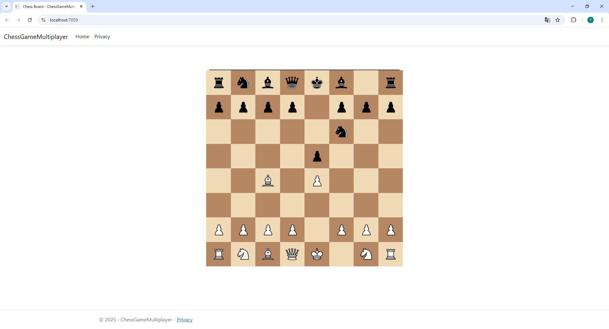
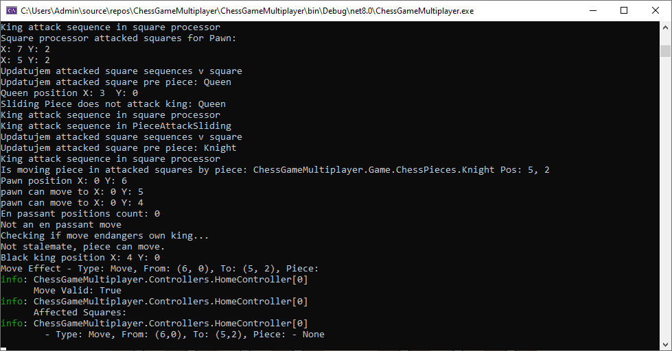

# Chess Multiplayer Web App (In Development)

This project is a **web-based chess application**, currently under active development. 
The project’s chess logic is built on a custom architecture I designed from scratch

## ✅ Implemented Features

The following chess mechanics are already implemented and working:

### ✔ Checkmate Detection

### ✔ Stalemate Detection

### ✔ Pawn Promotion

### ✔ Castling

### ✔ En Passant

## 🛠 Tech Stack

* **C# / ASP.NET Core** backend
* **JavaScript** frontend logic
* **Razor (.cshtml)** views
* **Custom chess engine implementation** (no external API used)

## 📌 Upcoming Features

* Multiplayer mode
* Timed matches
* Match history
* Player vs. AI (chess engine API integration)
* Improved UI

## App Screenshots

