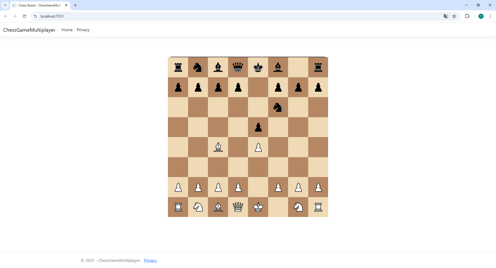
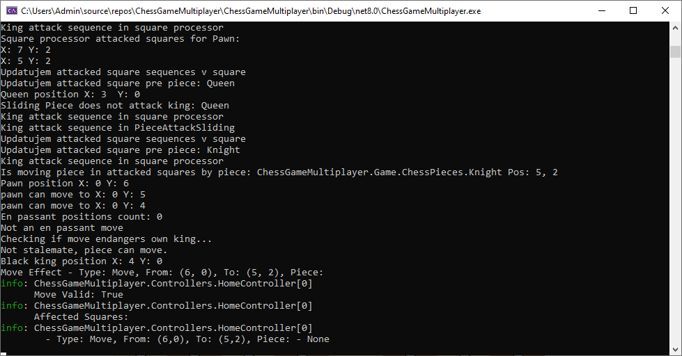
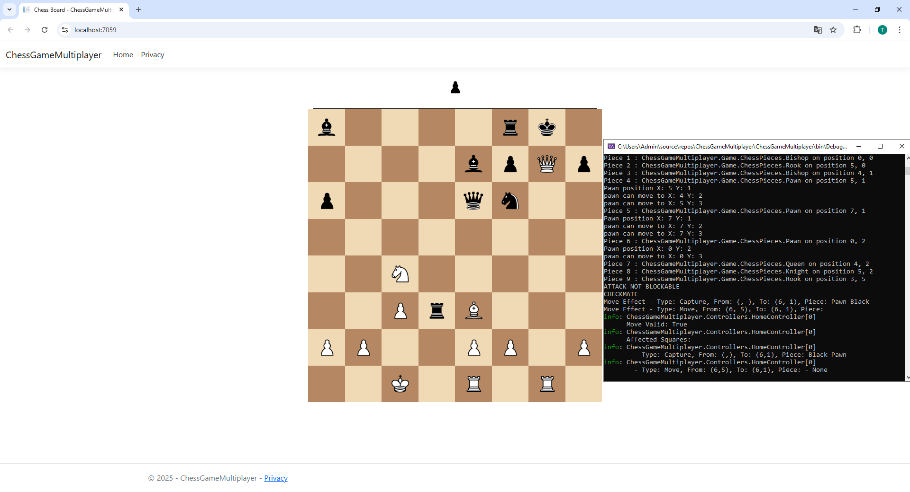
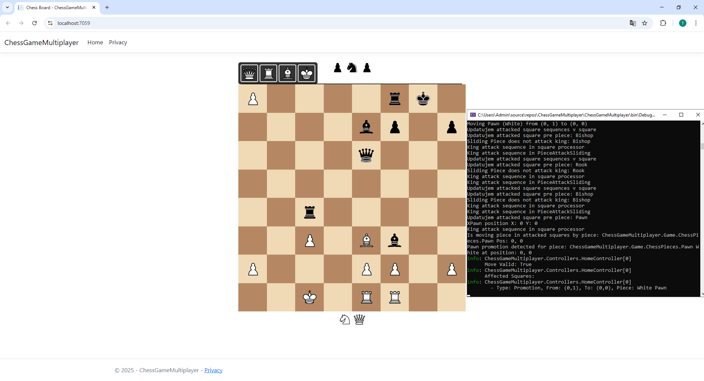
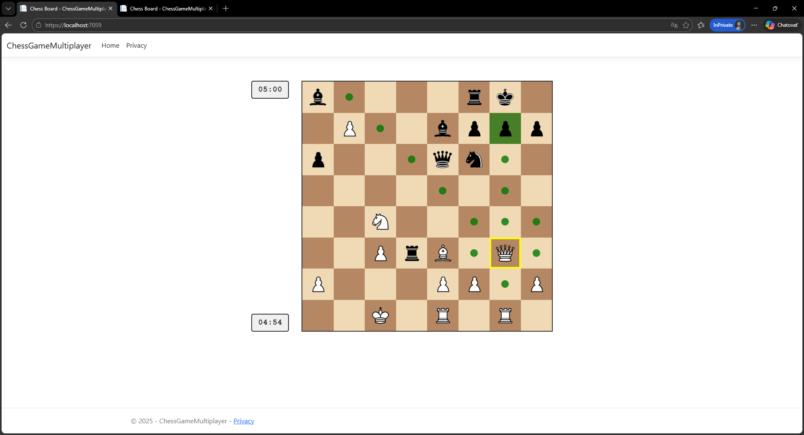
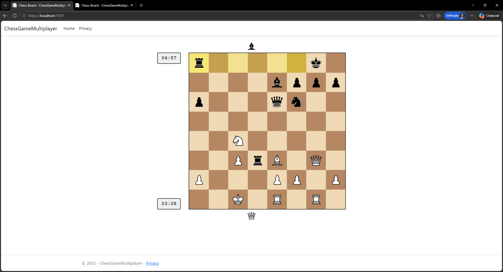

# Chess Multiplayer Web App 

This project is a **web-based chess application**, currently under active development. 
The project’s chess logic is built on a custom architecture I designed from scratch

## ✅ Implemented Features

The following features are already implemented and working:

### ✔ Checkmate Detection

### ✔ Stalemate Detection

### ✔ Pawn Promotion

### ✔ Castling

### ✔ En Passant

### ✔ 1v1 Online

### ✔ Highlights legal moves of a piece

### ✔ Highlights the most recent move

## 🛠 Tech Stack

* **C# / ASP.NET Core** backend
* **JavaScript** frontend logic
* **Razor (.cshtml)** views
* **Custom chess engine implementation** (no external API used)

## 📌 Upcoming Features

* Multiplayer mode with user accounts
* Match history
* Player vs. AI (chess engine API integration)
* Improved UI

## App Screenshots

Checkmate:

Promotion:

Legal moves highlight:

Most recent move highlight:

